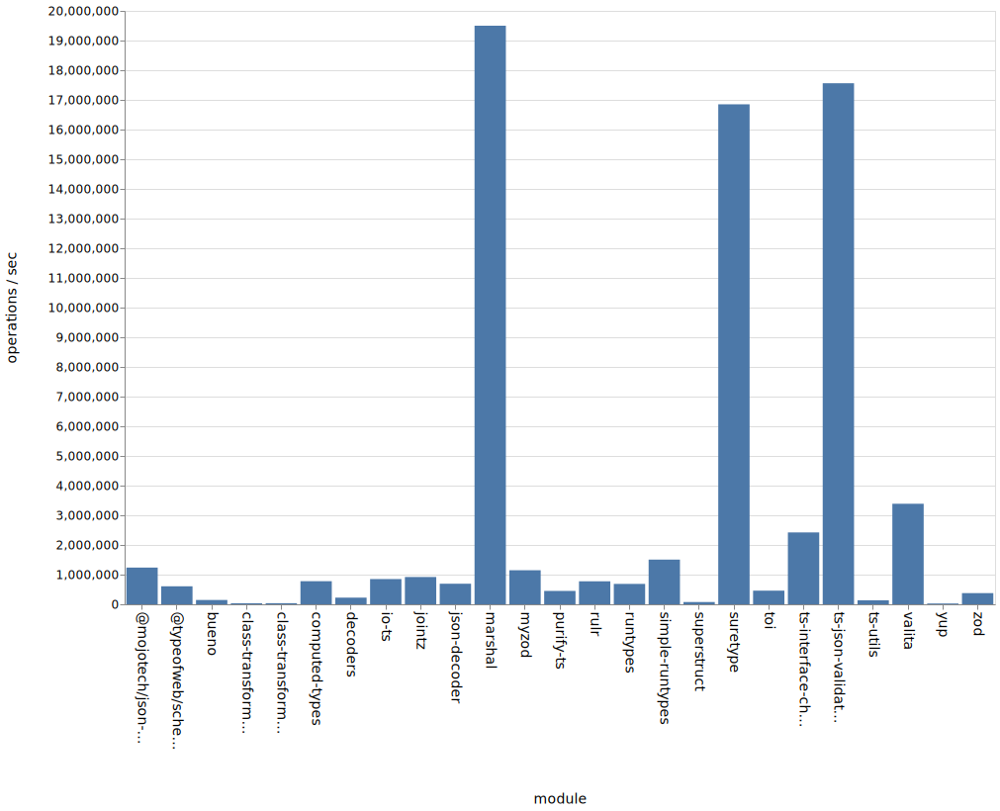
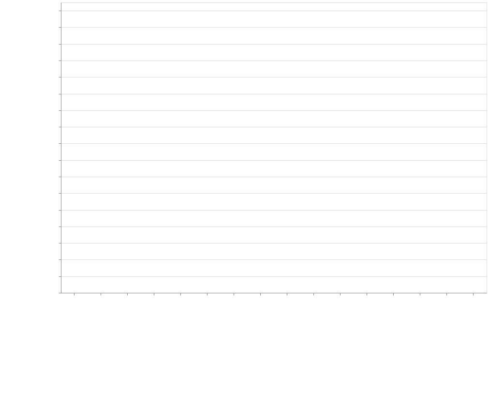
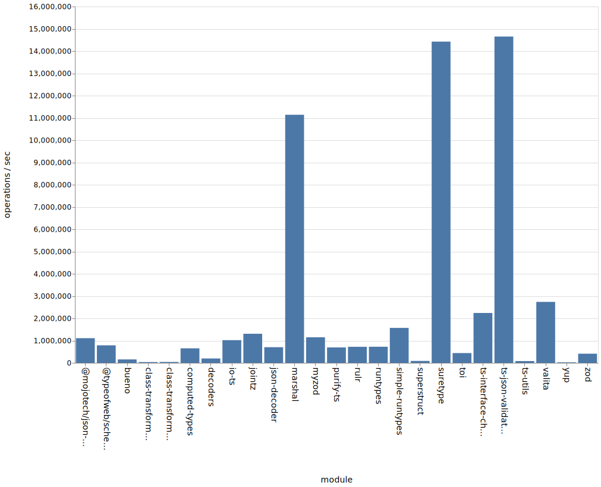
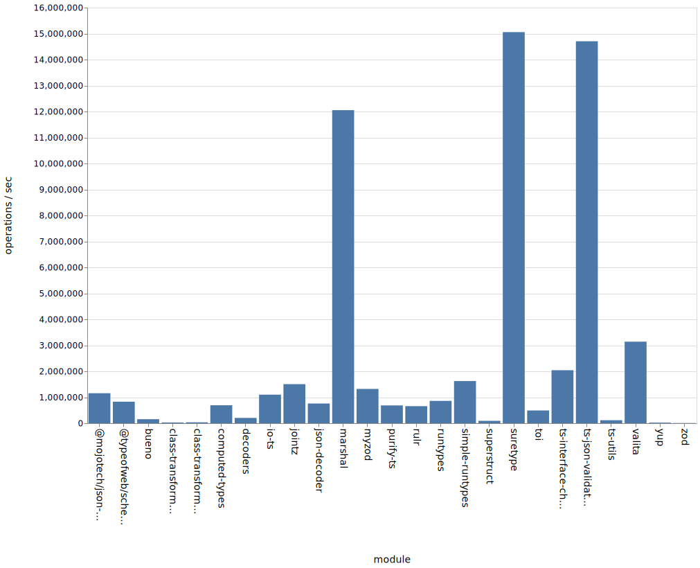
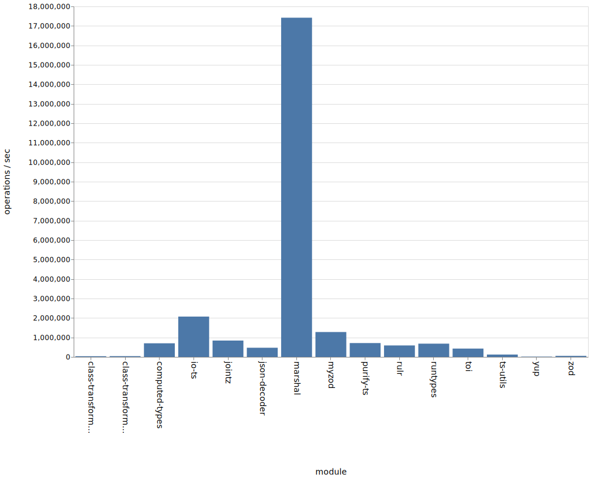
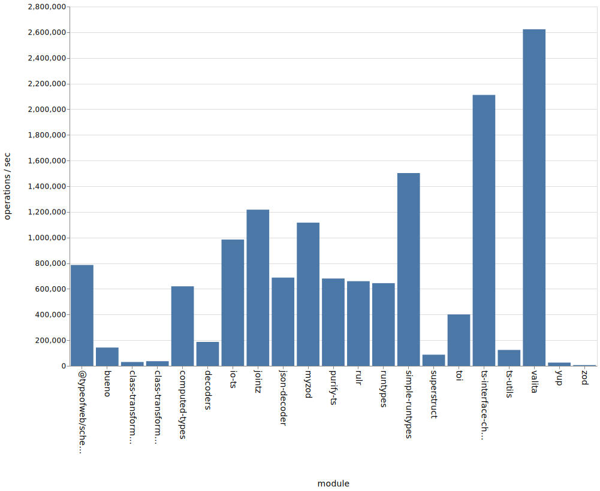
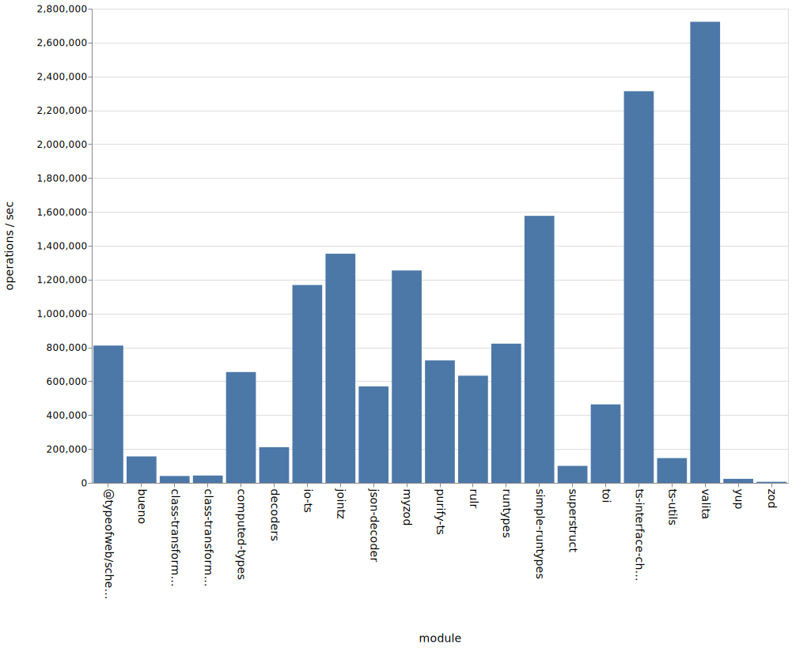

# 📊 Benchmark Comparison of Packages with Runtime Validation and TypeScript Support


> ⚠️ Note: Until [#497](https://github.com/moltar/typescript-runtime-type-benchmarks/issues/497) is resolved, some of the benchmarks in this repo are comparing apples-to-oranges due to the different APIs provided by validation libraries. Libraries which provide more functionality (like transformations, coercions, detailed errors) might be penalized for slower performance for those extra features.


## Packages Compared

* [bueno](https://github.com/philipnilsson/bueno)
* [class-validator](https://github.com/typestack/class-validator) + [class-transformer](https://github.com/typestack/class-transformer)
* [computed-types](https://github.com/neuledge/computed-types)
* [decoders](https://github.com/nvie/decoders)
* [io-ts](https://github.com/gcanti/io-ts)
* [jointz](https://github.com/moodysalem/jointz)
* [json-decoder](https://github.com/venil7/json-decoder)
* [marshal](https://github.com/marcj/marshal.ts)
* [myzod](https://github.com/davidmdm/myzod)
* [purify-ts](https://github.com/gigobyte/purify)
* [rulr](https://github.com/ryansmith94/rulr)
* [runtypes](https://github.com/pelotom/runtypes)
* [simple-runtypes](https://github.com/hoeck/simple-runtypes)
* [superstruct](https://github.com/ianstormtaylor/superstruct)
* [suretype](https://github.com/grantila/suretype)
* [toi](https://github.com/hf/toi)
* [ts-interface-checker](https://github.com/gristlabs/ts-interface-checker)
* [ts-json-validator](https://github.com/ostrowr/ts-json-validator)
* [ts-utils](https://github.com/ai-labs-team/ts-utils)
* [@typeofweb/schema](https://github.com/typeofweb/schema)
* [valita](https://github.com/badrap/valita)
* [yup](https://github.com/jquense/yup)
* [zod](https://github.com/vriad/zod)
* [mojotech/json-type-validaton](https://github.com/mojotech/json-type-validation)

## Criteria

### Validation

These packages are capable of validating the data for type correctness.

E.g. if `string` was expected, but a `number` was provided, the validator should fail.

### Interface

It has a validator function or method that returns a valid type casted value or throws.

```ts
const data: any = {}

// `res` is now type casted to the right type
const res = isValid(data)
```

Or it has a type guard function that in a truthy block type casts the value.

```ts
const data: any = {}

function isMyDataValid(data: any) {
  // isValidGuard is the type guard function provided by the package
  if (isValidGuard(data)) {
    // data here is "guarded" and therefore inferred to be of the right type
    return data
  }

  throw new Error('Invalid!')
}

// `res` is now type casted to the right type
const res = isMyDataValid(data)
```

## Benchmark Results

### Data Type Checks

#### Node 10.x ([JSON](./results/data-type-10.x.json), [CSV](./results/data-type-10.x.csv), [SVG](./results/data-type-10.x.svg))



#### Node 12.x ([JSON](./results/data-type-12.x.json), [CSV](./results/data-type-12.x.csv), [SVG](./results/data-type-12.x.svg))



#### Node 13.x ([JSON](./results/data-type-13.x.json), [CSV](./results/data-type-13.x.csv), [SVG](./results/data-type-13.x.svg))



#### Node 14.x ([JSON](./results/data-type-14.x.json), [CSV](./results/data-type-14.x.csv), [SVG](./results/data-type-14.x.svg))



### Data Type Checks Sans Outliers

Because some packages are so performant it makes it difficult to see the benchmarks for other packages.

This benchmark run includes all of the above packages, but excludes `marshal` and `ts-json-validator`.

#### Node 10.x ([JSON](./results/data-type-sans-outliers-10.x.json), [CSV](./results/data-type-sans-outliers-10.x.csv), [SVG](./results/data-type-sans-outliers-10.x.svg))



#### Node 12.x ([JSON](./results/data-type-sans-outliers-12.x.json), [CSV](./results/data-type-sans-outliers-12.x.csv), [SVG](./results/data-type-sans-outliers-12.x.svg))


#### Node 13.x ([JSON](./results/data-type-sans-outliers-13.x.json), [CSV](./results/data-type-sans-outliers-13.x.csv), [SVG](./results/data-type-sans-outliers-13.x.svg))



#### Node 14.x ([JSON](./results/data-type-sans-outliers-14.x.json), [CSV](./results/data-type-sans-outliers-14.x.csv), [SVG](./results/data-type-sans-outliers-14.x.svg))


