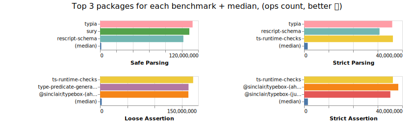

# 📊 Benchmark Comparison of Packages with Runtime Validation and TypeScript Support

- - - -
**⚡⚠ Benchmark results have changed after switching to isolated node processes for each benchmarked package, see [#864](https://github.com/moltar/typescript-runtime-type-benchmarks/issues/864) ⚠⚡**
- - - -

## Benchmark Results

[](https://moltar.github.io/typescript-runtime-type-benchmarks)

[click here for result details](https://moltar.github.io/typescript-runtime-type-benchmarks)

## Packages Compared

* [aeria](https://github.com/aeria-org/aeria)
* [ajv](https://ajv.js.org/)
* [ArkType](https://github.com/arktypeio/arktype)
* [banditypes](https://github.com/thoughtspile/banditypes)
* [bueno](https://github.com/philipnilsson/bueno)
* [caketype](https://github.com/justinyaodu/caketype)
* [class-validator](https://github.com/typestack/class-validator) + [class-transformer](https://github.com/typestack/class-transformer)
* [cleaners](https://cleaners.js.org)
* [computed-types](https://github.com/neuledge/computed-types)
* [decoders](https://github.com/nvie/decoders)
* [deepkit](https://deepkit.io/)
* [@effect/schema](https://github.com/Effect-TS/effect/blob/main/packages/schema/README.md)
* [io-ts](https://github.com/gcanti/io-ts)
* [jet-validators](https://github.com/seanpmaxwell/jet-validators)
* [joi] (https://github.com/hapijs/joi)
* [jointz](https://github.com/moodysalem/jointz)
* [json-decoder](https://github.com/venil7/json-decoder)
* [@mojotech/json-type-validaton](https://github.com/mojotech/json-type-validation)
* [$mol_data](https://github.com/hyoo-ru/mam_mol/blob/master/data/README.md)
* [@mondrian-framework/model](https://mondrianframework.com)
* [myzod](https://github.com/davidmdm/myzod)
* [ok-computer](https://github.com/richardscarrott/ok-computer)
* [pure-parse](https://github.com/johannes-lindgren/pure-parse)
* [purify-ts](https://github.com/gigobyte/purify)
* [parse-dont-validate](https://github.com/Packer-Man/parse-dont-validate)
* [Paseri](https://github.com/vbudovski/paseri)
* [r-assign](https://github.com/micnic/r-assign)
* [rescript-schema](https://github.com/DZakh/rescript-schema)
* [rulr](https://github.com/ryansmith94/rulr)
* [runtypes](https://github.com/pelotom/runtypes)
* [@sapphire/shapeshift](https://github.com/sapphiredev/shapeshift)
* [@sinclair/typebox](https://github.com/sinclairzx81/typebox)
* [@sinclair/typemap](https://github.com/sinclairzx81/typemap)
* [simple-runtypes](https://github.com/hoeck/simple-runtypes)
* [spectypes](https://github.com/iyegoroff/spectypes)
* [stnl](https://github.com/re-utils/stnl)
* [succulent](https://github.com/aslilac/succulent)
* [superstruct](https://github.com/ianstormtaylor/superstruct)
* [suretype](https://github.com/grantila/suretype)
* [tiny-schema-validator](https://github.com/5alidz/tiny-schema-validator)
* [to-typed](https://github.com/jsoldi/to-typed)
* [toi](https://github.com/hf/toi)
* [ts-auto-guard](https://github.com/rhys-vdw/ts-auto-guard)
* [ts-interface-checker](https://github.com/gristlabs/ts-interface-checker)
* [ts-json-validator](https://github.com/ostrowr/ts-json-validator)
* [ts-runtime-checks](https://github.com/GoogleFeud/ts-runtime-checks)
* [tson](https://github.com/skarab42/tson)
* [ts-utils](https://github.com/ai-labs-team/ts-utils)
* [type-predicate-generator](https://github.com/peter-leonov/typescript-predicate-generator)
* [typia](https://github.com/samchon/typia)
* [@typeofweb/schema](https://github.com/typeofweb/schema)
* [unknownutil](https://github.com/lambdalisue/deno-unknownutil)
* [valibot](https://github.com/fabian-hiller/valibot)
* [valita](https://github.com/badrap/valita)
* [Vality](https://github.com/jeengbe/vality)
* [yup](https://github.com/jquense/yup)
* [zod](https://github.com/colinhacks/zod)
* [zod (v4)](https://github.com/colinhacks/zod/tree/v4)

## Criteria

### Validation

These packages are capable of validating the data for type correctness.

E.g. if `string` was expected, but a `number` was provided, the validator should fail.

### Interface

It has a validator function or method that returns a valid type casted value or throws.

```ts
const data: any = {}

// `res` is now type casted to the right type
const res = isValid(data)
```

Or it has a type guard function that in a truthy block type casts the value.

```ts
const data: any = {}

function isMyDataValid(data: any) {
  // isValidGuard is the type guard function provided by the package
  if (isValidGuard(data)) {
    // data here is "guarded" and therefore inferred to be of the right type
    return data
  }

  throw new Error('Invalid!')
}

// `res` is now type casted to the right type
const res = isMyDataValid(data)
```

## Local Development

### Commands

#### Benchmarks

* `npm run start` - run benchmarks for all modules using Node.js
* `npm run start:bun` - run benchmarks for all modules using bun
* `npm run start run zod myzod valita` - run benchmarks only for a few selected modules

#### Tests

* `npm run test` - run build process and tests for all modules
* `npm run test:build` - run build process for all modules

#### Benchmark Viewer

A basic preact+vite app lives in [`/docs`](/docs).
It is deployed via github pages whenever something has been pushed to the main branch.

```sh
cd docs

npm run dev     # develop / view results
npm run build   # build
npm run preview # preview the build
```

When viewing results locally, you will need to restart the app whenever the
results are updated.

#### Linting

* `npm run lint` - lint all files
* `npm run lint:fix` - lint all files and fix errors

#### Misc

* `npm run download-packages-popularity` - download popularity data from npmjs.com

### Debugging

#### Node.js

* Use [nvm](https://github.com/nvm-sh/nvm) to switch to a specific Node.js version
* `nvm use x` - switch to Node.js x.x
* `nvm use 18` - switch to Node.js 18.x
* `nvm use 20` - switch to Node.js 20.x

#### Bun

* Use `curl -fsSl https://bun.sh/install | bash -s "bun-v1.0.x"` to switch to a specific bun version
* `curl -fsSl https://bun.sh/install | bash -s "bun-v1.1.43"` - switch to bun 1.1.43

#### Deno

* Use `deno upgrade x.x.x` to switch to a specific Deno version
* `deno upgrade stable` - switch to Deno x.x.x

## Adding new runtime version

### Node.js runtime

* update Node.js version matrix in `.github/workflows/pr.yml` and `.github/workflows/release.yml`
* update `NODE_VERSIONS` in `docs/src/App.tsx`
* optionally set `NODE_VERSION_FOR_PREVIEW` in `benchmarks/helpers/main.ts`

### Bun runtime

* update bun version matrix in `.github/workflows/pr.yml` and `.github/workflows/release.yml`
* update `BUN_VERSIONS` in `docs/src/App.tsx`

### Deno runtime

* update Deno version matrix in `.github/workflows/pr.yml` and `.github/workflows/release.yml`
* update `DENO_VERSIONS` in `docs/src/App.tsx`

## Test cases

* **Safe Parsing**
  * Checks the input object against a schema and returns it.
  * Raises an error if the input object does not conform to the schema (e.g., a type mismatch or missing attribute).
  * Removes any extra keys in the input object that are not defined in the schema.

* **Strict Parsing**
  * Checks the input object against a schema and returns it.
  * Raises an error if the input object does not conform to the schema (e.g., a type mismatch or missing attribute).
  * Raises an error if the input object contains extra keys.

* **Loose Assertion**
  * Checks the input object against a schema.
  * Raises an exception if the input object does not match the schema.
  * Allows extra keys without raising errors.
  * Returns true if data is valid.

* **Strict Assertion**
  * Checks the input object against a schema.
  * Raises an exception if the input object does not match the schema.
  * Raises an error if the input object or any nested input objects contain extra keys.
  * Returns true if data is valid.

## Contributors

<a href="https://github.com/moltar/typescript-runtime-type-benchmarks/graphs/contributors">
  
</a>
