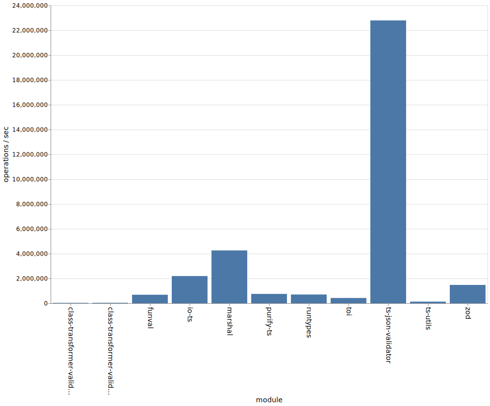
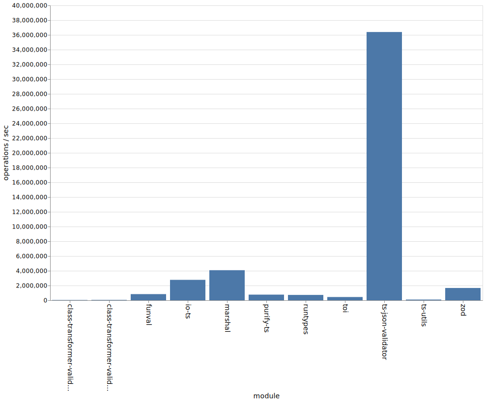

# 📊 Benchmark Comparison of Packages with Runtime Validation and Typescript Support

## Packages Compared

* [class-validator](https://github.com/typestack/class-validator) + [class-transformer](https://github.com/typestack/class-transformer)
* [funval](https://github.com/neuledge/funval)
* [io-ts](https://github.com/gcanti/io-ts)
* [marshal](https://github.com/marcj/marshal.ts)
* [purify-ts](https://github.com/gigobyte/purify)
* [runtypes](https://github.com/pelotom/runtypes)
* [toi](https://github.com/hf/toi)
* [ts-json-validator](https://github.com/ostrowr/ts-json-validator)
* [ts-utils](https://github.com/ai-labs-team/ts-utils)
* [zod](https://github.com/vriad/zod)

## Criteria

### Validation

These packages are capable of validating the data for type correctness.

E.g. if `string` was expected, but a `number` was provided, the validator should fail.

### Interface

It has a validator function or method that returns a valid type casted value or throws.

```ts
const data: any = {}

// `res` is now type casted to the right type
const res = isValid(data)
```

Or it has a type guard function that in a truthy block type casts the value.

```ts
const data: any = {}

function isMyDataValid(data: any) {
  // isValidGuard is the type guard function provided by the package
  if (isValidGuard(data)) {
    // data here is "guarded" and therefore inferred to be of the right type
    return data
  }

  throw new Error('Invalid!')
}

// `res` is now type casted to the right type
const res = isMyDataValid(data)
```

## Benchmark Results

### Node 10.x ([JSON](./results/benchmarks-10.x.json), [CSV](./results/benchmarks-10.x.csv), [SVG](./results/bar-graph-10.x.svg))



### Node 12.x ([JSON](./results/benchmarks-12.x.json), [CSV](./results/benchmarks-12.x.csv), [SVG](./results/bar-graph-12.x.svg))


