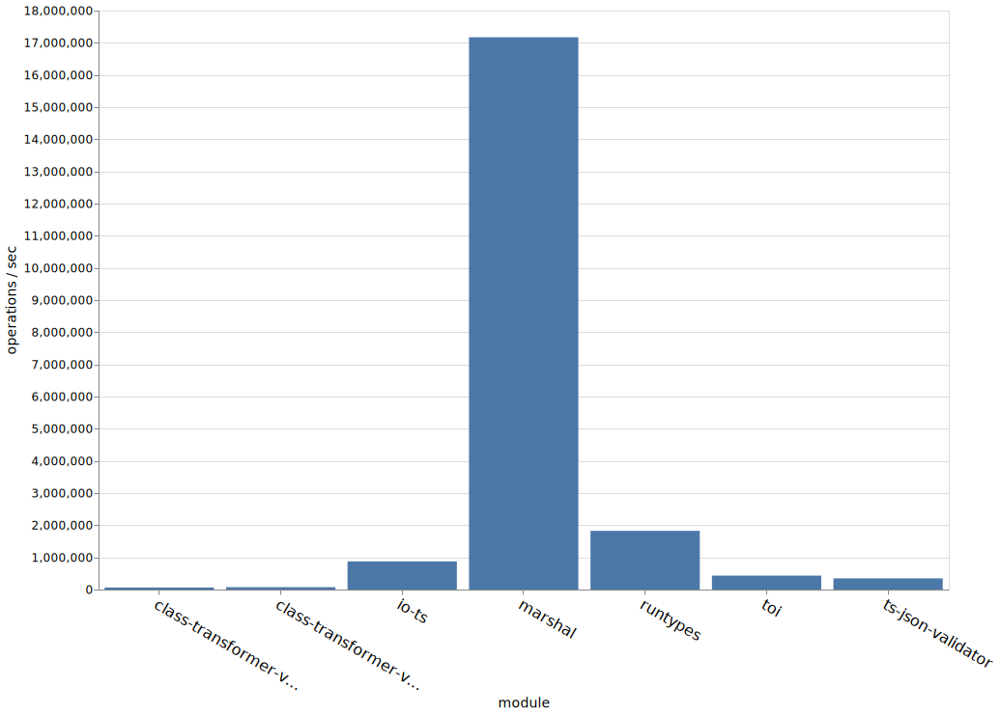

# Benchmark Comparison of TypeScript Runtime Type Support Modules

> Write up coming soon...

Compares run time type validation of the following packages:

* [class-validator](https://github.com/typestack/class-validator) + [class-transformer](https://github.com/typestack/class-transformer)
* [io-ts](https://github.com/gcanti/io-ts)
* [masrshal](https://github.com/marcj/marshal.ts)
* [runtypes](https://github.com/pelotom/runtypes)
* [toi](https://github.com/hf/toi)
* [ts-json-validator](https://github.com/ostrowr/ts-json-validator)

Note that, "JSON Encode Decode" method is not truly a runtime type checker,
but it is included simply for a sort-of benchmark against other JS operations. It encodes and decodes
the same data object and returns it, without any validation.

## Node 8.x

## Node 10.x

## Node 12.x

