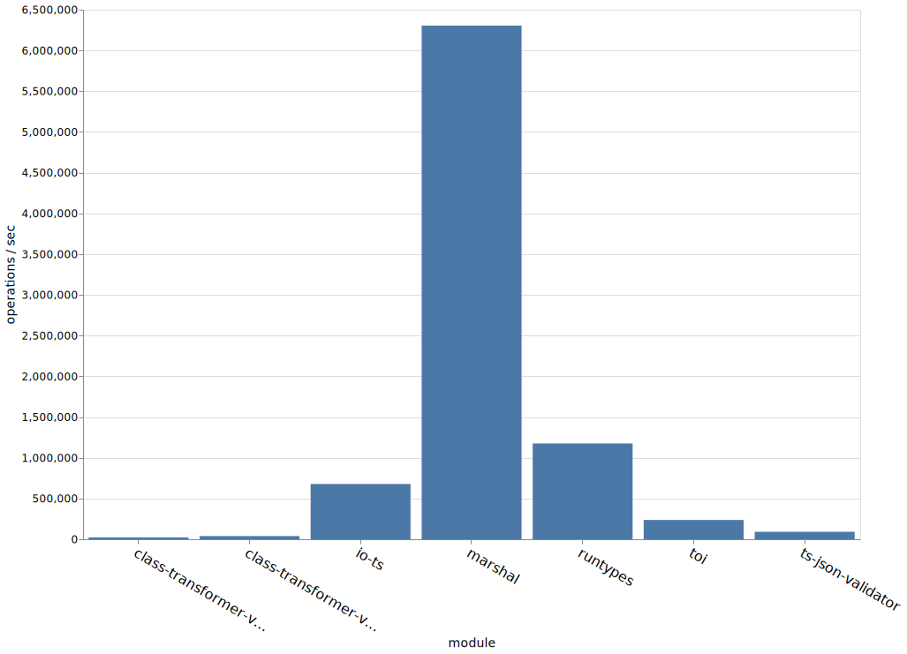

# Benchmark Comparison of TypeScript Runtime Type Support Modules

> Write up coming soon...

Note that, "JSON Encode Decode" method is not truly a runtime type checker,
but it is included simply for a sort-of benchmark against other JS operations. It encodes and decodes
the same data object and returns it, without any validation.

## Node 8.x

## Node 10.x

## Node 12.x

