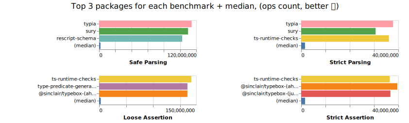

# 📊 Benchmark Comparison of Packages with Runtime Validation and TypeScript Support

- - - -
**⚡⚠ Benchmark results have changed after switching to isolated node processes for each benchmarked package, see [#864](https://github.com/moltar/typescript-runtime-type-benchmarks/issues/864) ⚠⚡**
- - - -

## Benchmark Results

[](https://moltar.github.io/typescript-runtime-type-benchmarks)

[click here for result details](https://moltar.github.io/typescript-runtime-type-benchmarks)

## Packages Compared

* [ajv](https://ajv.js.org/)
* [bueno](https://github.com/philipnilsson/bueno)
* [class-validator](https://github.com/typestack/class-validator) + [class-transformer](https://github.com/typestack/class-transformer)
* [computed-types](https://github.com/neuledge/computed-types)
* [decoders](https://github.com/nvie/decoders)
* [io-ts](https://github.com/gcanti/io-ts)
* [jointz](https://github.com/moodysalem/jointz)
* [json-decoder](https://github.com/venil7/json-decoder)
* [marshal](https://github.com/marcj/marshal.ts)
* [@mojotech/json-type-validaton](https://github.com/mojotech/json-type-validation)
* [myzod](https://github.com/davidmdm/myzod)
* [ok-computer](https://github.com/richardscarrott/ok-computer)
* [purify-ts](https://github.com/gigobyte/purify)
* [parse-dont-validate](https://github.com/Packer-Man/parse-dont-validate)
* [r-assign](https://github.com/micnic/r-assign)
* [rescript-struct](https://github.com/DZakh/rescript-struct)
* [rulr](https://github.com/ryansmith94/rulr)
* [runtypes](https://github.com/pelotom/runtypes)
* [@sapphire/shapeshift](https://github.com/sapphiredev/shapeshift)
* [@sinclair/typebox](https://github.com/sinclairzx81/typebox)
* [simple-runtypes](https://github.com/hoeck/simple-runtypes)
* [spectypes](https://github.com/iyegoroff/spectypes)
* [superstruct](https://github.com/ianstormtaylor/superstruct)
* [suretype](https://github.com/grantila/suretype)
* [toi](https://github.com/hf/toi)
* [ts-interface-checker](https://github.com/gristlabs/ts-interface-checker)
* [ts-json-validator](https://github.com/ostrowr/ts-json-validator)
* [ts-runtime-checks](https://github.com/GoogleFeud/ts-runtime-checks)
* [tson](https://github.com/skarab42/tson)
* [ts-utils](https://github.com/ai-labs-team/ts-utils)
* [@typeofweb/schema](https://github.com/typeofweb/schema)
* [valita](https://github.com/badrap/valita)
* [Vality](https://github.com/jeengbe/vality)
* [yup](https://github.com/jquense/yup)
* [zod](https://github.com/vriad/zod)

## Criteria

### Validation

These packages are capable of validating the data for type correctness.

E.g. if `string` was expected, but a `number` was provided, the validator should fail.

### Interface

It has a validator function or method that returns a valid type casted value or throws.

```ts
const data: any = {}

// `res` is now type casted to the right type
const res = isValid(data)
```

Or it has a type guard function that in a truthy block type casts the value.

```ts
const data: any = {}

function isMyDataValid(data: any) {
  // isValidGuard is the type guard function provided by the package
  if (isValidGuard(data)) {
    // data here is "guarded" and therefore inferred to be of the right type
    return data
  }

  throw new Error('Invalid!')
}

// `res` is now type casted to the right type
const res = isMyDataValid(data)
```

## Local Development

* `npm run start` - run benchmarks for all modules
* `npm run start run zod myzod valita` - run benchmarks only for a few selected modules
* `npm run docs:serve` - result viewer
* `npm run test` - run tests on all modules
